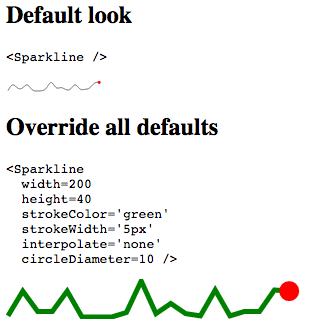

class: center, middle, inverse

# Turning the Tables

### Alastair Maw

(@herebebeasties on Twitter + Github)

---

class: center, middle, inverse
# When should you componentise your code?

---

### JSX:
```
render: function () {
  var contacts = // ... (this.props.contacts, perhaps?)
  var rows = contacts.map(function (contact) {
    return (
      <tr>
        <td>{contact.name}</td>
        <td>{contact.dateOfBirth}</td>
      </tr>
    );
  });
  return <table>{rows}</table>;
}
```

### Angular:
```xml
<table>
  <tr ng-repeat="contact in contacts">
    <td>{{contact.name}}</td>
    <td>{{contact.dateOfBirth}}</td>
  </tr>
</table>
```

---

### Add a header row:
```
render: function () {
  var rows = contacts.map(function (contact) {
    return (
      <tr>
        <td>{contact.name}</td>
        <td>{contact.dateOfBirth}</td>
      </tr>
    );
  });
  return (
    <table>
      <thead>
        <th>Name</th>
        <th>Date of birth</th>
      </thead>
      <tbody>{rows}</tbody>
    </table>
  );
}
```

---

### Put it all in one place:

```
var columns = [
  { field: 'name', title: 'Name' },
  { field: 'dateOfBirth', title: 'Date of birth' }
];
```

---

### table.jsx
```
var Table = React.createClass({
  getHeaders: function () {
    return this.props.columns.map(function (column) {
      return <th>{column.title}</th>;
    });
  },

  getRows: function () {
    return this.props.items.map(function (item) {
      var cells = this.props.columns.map(function (column) {
        return getCell(item, column);
      });
      return <tr>{cells}</tr>;
    });
  },

  getCell: function (item, column) {
    return <td>{item[column.field]}</td>;
  },

  render: function () {
    return (
      <table>
        <thead>{this.getHeaders()}</thead>
        <tbody>{this.getRows()}</tbody>
      </table>
    );
  }
});
```
---

### contacts-table.jsx
```
var Table = require('components/table');
var ContactsStore = require('stores/contacts-store');

module.exports = React.createClass({
  columns = [
    { field: 'name', title: 'Name' },
    { field: 'dateOfBirth', title: 'Date of birth' }
  ],
  render: function () {
    return <Table columns={this.columns} items={ContactsStore.getContacts()}/>;
  }
});
```

---

# That's a bit... _basic_

Yes, it is. You will want to add at least some of:

### Functionality
 - Sorting
 - Filtering
 - Pagination
 - Infinite scroll
 - Charting (sparklines, etc.)
 - Export

### Display
 - Styling
 - Column alignment (automatic?)
 - Reactive display (esp. for mobile)
 - Fixed-width columns
 - Tooltips
   - to explain column headers
   - for truncated fixed-width cells with overflow: hidden
 - Fixed headers
 - Angled headers

---
# sifter.js for sorting & filtering

https://github.com/brianreavis/sifter.js

```javascript
var sifter = new Sifter([
    {title: 'Annapurna I', location: 'Nepal', continent: 'Asia'},
    {title: 'Annapurna II', location: 'Nepal', continent: 'Asia'},
    {title: 'Annapurna III', location: 'Nepal', continent: 'Asia'},
    {title: 'Eiger', location: 'Switzerland', continent: 'Europe'},
    {title: 'Everest', location: 'Nepal', continent: 'Asia'},
    {title: 'Gannett', location: 'Wyoming', continent: 'North America'},
    {title: 'Denali', location: 'Alaska', continent: 'North America'}
]);

var result = sifter.search('anna', {
    fields: ['title', 'location', 'continent'],
    sort: [{field: 'title', direction: 'asc'}],
    limit: 3
});
```

```
{"score": 0.2878787878787879, "id": 0},
{"score": 0.27777777777777773, "id": 1},
{"score": 0.2692307692307692, "id": 2}
```
---

# Sort arrows in pure CSS
http://css-tricks.com/snippets/css/css-triangle
```
.arrow-up {
  width: 0;
  height: 0;
  border-left: 10px solid transparent;
  border-right: 10px solid transparent;
  border-bottom: 15px solid black;
}

.arrow-down {
  width: 0;
  height: 0;
  border-left: 10px solid transparent;
  border-right: 10px solid transparent;
  border-top: 15px solid black;
}

<div class="arrow-up"></div>
<div class="arrow-down"></div>
```
<style>
.arrow-up {
  width: 0;
  height: 0;
  border-left: 10px solid transparent;
  border-right: 10px solid transparent;
  border-bottom: 15px solid black;
}
.arrow-down {
  margin-top: 3px;
  width: 0;
  height: 0;
  border-left: 10px solid transparent;
  border-right: 10px solid transparent;
  border-top: 15px solid black;
}
</style>
<div class="arrow-up"></div>
<div class="arrow-down"></div>
---

# Pagination

Bootstrap (http://getbootstrap.com):
<nav>
  <ul class="pagination">
    <li class="disabled"><a href="#"><span aria-hidden="true">&laquo;</span><span class="sr-only">Previous</span></a></li>
    <li class="active"><a href="#">1 <span class="sr-only">(current)</span></a></li>
    <li><a href="#">2</a></li>
    <li><a href="#">3</a></li>
    <li><a href="#">4</a></li>
    <li><a href="#">5</a></li>
    <li><a href="#"><span aria-hidden="true">&raquo;</span><span class="sr-only">Next</span></a></li>
  </ul>
</nav>

```xml
<nav>
  <ul class="pagination">
    <li class="disabled"><a href="#"><span aria-hidden="true">&laquo;</span><span class="sr-only">Previous</span></a></li>
    <li class="active"><a href="#">1 <span class="sr-only">(current)</span></a></li>
    <li><a href="#">2</a></li>
    <li><a href="#">3</a></li>
    <li><a href="#">4</a></li>
    <li><a href="#">5</a></li>
    <li><a href="#"><span aria-hidden="true">&raquo;</span><span class="sr-only">Next</span></a></li>
  </ul>
</nav>
```

---

# Styling
Bootstrap again:
<table class="table table-striped table-bordered table-hover">
  <thead>
    <tr><th>Name</th><th>Date of birth</th></tr>
  </thead>
  <tbody>
    <tr><td>Tom</td><td>1980-05-20</td></tr>
    <tr><td>Dick</td><td>1991-02-04</td></tr>
    <tr><td>Harry</td><td>1976-12-17</td></tr>
  </tbody>
</table>

```
<table class="table table-striped table-bordered table-hover">
  <thead>
    <tr><th>Name</th><th>Date of birth</th></tr>
  </thead>
  <tbody>
    <tr><td>Tom</td><td>1980-05-20</td></tr>
    <tr><td>Dick</td><td>1991-02-04</td></tr>
    <tr><td>Harry</td><td>1976-12-17</td></tr>
  </tbody>
</table>
```
---

class: center, middle, inverse

# React-Bootstrap

http://react-bootstrap.github.io


---

# Responsive design
 - Bootstrap tables give you horizontal scrolling on smaller devices (&lt;768px). Wrap your `<table>` element in another element with `class="table-responsive"`


 - Use CSS media queries to set the visibility of `<colgroup>` elements:
   ```css
    @media (max-width: 600px) {
      colgroup.optional {
        visibility: collapse;
      }
    }```

 - Hook into React's `componentDidMount` lifecycle function to do some layout in JavaScript:
   ```
    handleResize: function(e) {
      this.setState({windowWidth: window.innerWidth});
    },
    componentDidMount: function() {
      window.addEventListener('resize', this.handleResize);
    },
    componentWillUnmount: function() {
      window.removeEventListener('resize', this.handleResize);
    }```
   See http://facebook.github.io/react/tips/dom-event-listeners.html for more info.

---

# Charting

 - [React-Sparkline](http://kyleamathews.github.io/react-sparkline/) is very easy:

   

 - For more complex things, either use [D3.js](http://d3js.org/), or use bits of it (ranges, etc.) to help you render SVG directly from React.

 - There are a lot of commonalities between React & D3, but that's a whole other talk.

---

# Embedded line chart:
http://bl.ocks.org/llimllib/841dd138e429bb0545df
<iframe src="http://bl.ocks.org/llimllib/raw/841dd138e429bb0545df/" width="100%" height="100%" style="border: none; overflow: hidden"/>

# Export

### Excel
 - Excel XLSX format is a ZIP file containing XML files.
   - [ExcelBuilder](http://excelbuilderjs.com/) writes XML and uses [JSZip](https://github.com/Stuk/jszip) to make the zip files.
   - [FileSaver.js](https://github.com/eligrey/FileSaver.js) implements the HTML5 W3C `saveAs()` interface in browsers that don't support it.

### CSV
 - Some good code on Stack Overflow here: http://stackoverflow.com/a/24922761/217893

### Clipboard
 - Intercept the <kbd>CTRL</kbd> / <kbd>CMD</kbd> keydown event
 - Push the text to be copied into a hidden text area
 - Select the text in that text area, so that by the time the user hits the <kbd>C</kbd> key it does what they expect
 - Implementation of this here: http://stackoverflow.com/a/17528590/217893

---

# Infinite scroll
Trivial - just hook the scroll event:
```javascript
componentDidMount: function(elem) {
  // Cross-browser issues here are a bit thorny - use jQuery:
  window.addEventListener('scroll', function() {
    if ($(window).scrollTop() == $(document).height() - $(window).height()) {
      // Perform AJAX request here to add more rows (remember to
      // bail out if there's already a request in progress!)
    }
  }.bind(this));
}
```

---

# Virtual scroll
Given first row `i` that is visible, out of `n` items total, with `c` items visible in the current window,
keep a `<div>` with three children updated such that:
 - First child is padding, height === sum of heights of invisible rows from `0` to `i`.
 - Middle child contains visible rows, height == sum of heights of visible rows.
 - Last child is padding, height === sum of heights of rows from `i + c` to `n`.

When the user scrolls, we repaint the scene.
<hr/>
### react-list
[react-list](https://github.com/orgsync/react-list) improves on this by buffering elements offscreen by a configurable number of pixels (defaults to 500px).


#### Issues:
 - Doesn't hook <kbd>PageUp</kbd> / <kbd>PageDn</kbd> (currently scrolls right to the home/end)
 - Really needs fixed / pinned headers, which doesn't work well with automatically-sized columns

---
class: center, middle, inverse

### Alastair Maw

@herebebeasties on Twitter & Github

https://github.com/herebebeasties
